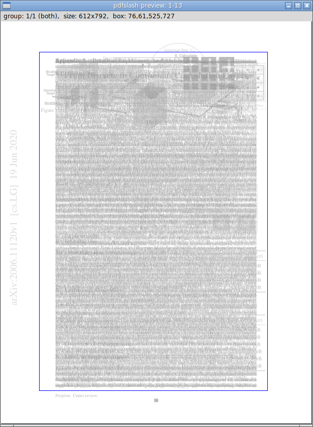

Introduction
============

This Python program helps batch-edit PDF page margins.

It runs an interactive interpreter as an intermediate layer.
Various commands, including GUI, are called from there.

Intended to create more readable PDF documents for e-reader devices,
for personal reading.

Technical Overview
------------------

* Use `PyMuPDF <https://pypi.org/project/PyMuPDF/>`__ to process PDF.

* Use `Numpy <https://pypi.org/project/numpy/>`__ to process image pixel data.

* Borrow algorithms from `briss <https://github.com/fatso83/briss-archived>`__,
  for key functions (page merging and auto margin detection).

* interpreter is a subclass of standard library `cmd <https://docs.python.org/3/library/cmd.html>`__.

* GUI part is a subclass of standard library `tkinter <https://docs.python.org/3/library/tkinter.html>`__.

Installation
------------

.. code-block:: none

    $ pip install pdfslash

You also need to install ``PyMuPDF`` and ``Numpy``.

Main Workflow
-------------

It requires one argument, pdf filename.

.. code-block:: none

    $ pdfslash some-pdf-file

Upon invocation, users are faced with a commandline prompt.

.. code-block:: none

    (pdfslash) <-- this

Most commands only take one argument (page numbers),
``crop`` takes two (page numbers and cropbox).

.. code-block:: none

    (pdfslash) info 1-3,7

        # Show page cropbox info for page 1,2,3,7

    (pdfslash) crop 6-9 30,30,400,500

        # Replace with new cropbox (left,top,right,bottom),
        # for page 6,7,8,9.

To run GUI, use ``preview``.

.. code-block:: none

    (pdfslash) preview 1-100

In GUI, Pages are grouped by their source cropbox sizes.

Pages of each group are merged into one grayscale image, as in ``briss``.

Only one (initially first) image is shown in GUI window.
You can navigate by keys ``n`` and ``p`` (next and previous).

Each image has actually three views, ``all``, ``odds`` and ``evens``.
E.g. if the pages of a group is ``2-5,9``,
``all`` is ``2,3,4,5,9``, ``odds`` is ``3,5,9`` and ``evens`` is ``2,4``.
You can cycle them by keys ``v`` and ``V`` (forward and backward).

If there are previously created boxes (say, previous boxes), they are also shown.
Boxes in all pages (in this group and view) are in blue, and boxes just in some pages
are in a bit lighter blue.

In any of group and view, you can create a new box (future cropbox) with mouse.
Click (top-left), drag and release (bottom-right).
The created box is shown with dotted lines.

Adjust the box with cursor keys.
``Left``, ``Right``, ``Up`` and ``Down`` keys move top-left point by one pixel.
With ``Shift`` (``Shift + Left`` etc.), the keys move bottom-right point.

By pressing ``Enter (Return)``,
the box is now registered. Until then, the box existed only as GUI graphic.
The dotted lines of box change to solid lines.

Just pressing ``Enter``,
the new one replaces all the previous boxes.
That is, if any, they were removed.

With ``Shift + Enter``,
the new one is appended. The previous boxes are preserved.

You can cycle 'active' box.
Initially the active box is ``sel``, a virtual box,
(one with dotted lines created by mouse click, or non-existent).

But Pressing ``a``,
the active box cycles to one of previous boxes in order, if any.
The color changes to orange.
In this state, you can edit previous boxes with cursor and ``Enter`` keys
(Other previous boxes are preserved).

With ``u`` and ``r``, the program performs undo and redo.
They are only for box registrations, other states are initialized.

To exit GUI, press ``q``.

To actually create a new PDF file, use ``write``.

.. code-block:: none

    (pdfslash) write 2-48

It creates a new file with '_slashed' appended to the filename.
(E.g. ``some.pdf`` to ``some_slashed.pdf``).
