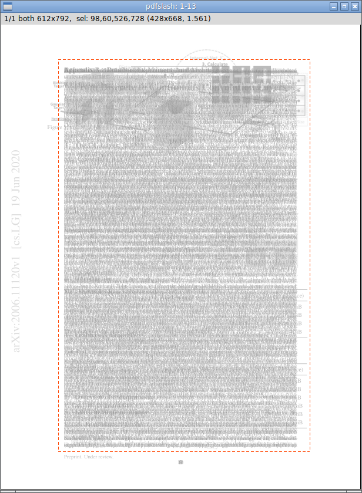

Introduction
============

This Python program helps batch-edit PDF page margins.

It runs an interactive interpreter as an intermediate layer.
Various commands, including GUI, are called from there.

Intended to create more readable PDF documents for e-reader devices,
for personal reading.

Technical Overview
------------------

* Use `PyMuPDF <https://pypi.org/project/PyMuPDF/>`__ to process PDF.

* Use `Numpy <https://pypi.org/project/numpy/>`__ to process image pixel data.

* Borrow algorithms from `briss <https://github.com/fatso83/briss-archived>`__,
  for key functions (page merging and auto margin detection).

* interpreter and GUI are using Python standard libraries (
  `cmd <https://docs.python.org/3/library/cmd.html>`__
  and `tkinter <https://docs.python.org/3/library/tkinter.html>`__).

Installation
------------

.. code-block:: none

    $ pip install pdfslash

The command installs the program, a single pure Python module.
But you also need to install ``PyMuPDF`` and ``Numpy`` yourself.

(To use ``'info'`` interpreter command,
``PyMuPDF v1.18.7`` or later is required).

Main Workflow
-------------

It requires one argument, pdf filename.

.. code-block:: none

    $ pdfslash some.pdf

Upon invocation, users are faced with a commandline prompt.

.. code-block:: none

    (pdfslash) <-- this

**Interpreter Commands**:

Most commands only take one argument (page numbers),
box commands take two or three.

.. code-block:: none

    (pdfslash) show 1-3,7

        # Show box data for page 1,2,3,7

    (pdfslash) crop 6-9 30,30,400,500

        # Append new box (left,top,right,bottom),
        # for page 6,7,8,9.

**GUI**:

To run GUI, use ``preview``.

.. code-block:: none

    (pdfslash) preview 1-100

In GUI, Pages are grouped by their source mediabox and cropbox sizes
(See Spec ``preview`` command for details).

Pages of each group are merged into one grayscale image, as in ``briss``.

Each image size is equal to their mediabox size.

Only one (initially first) image is shown in GUI window.
You can navigate by keys ``n`` and ``p`` (next and previous).

Each image has actually three views, ``all``, ``odds`` and ``evens``.
E.g. if the pages of a group is ``2-5,9``,
``all`` is ``2,3,4,5,9``, ``odds`` is ``3,5,9`` and ``evens`` is ``2,4``.
You can cycle them by keys ``v`` and ``V`` (forward and backward).

Source cropboxes are shown in green.
You can toggle visibility (show and hide) by key ``s`` (source cropbox).

But when cropbox is equal to mediabox (in most cases),
you can not see it anyway.

If there are previously created boxes (say, previous boxes), they are also shown.
Boxes in all pages (in this group and view) are in blue, and boxes just in some pages
are in a bit lighter blue.

**Crop**:

In any of group and view, you can create a new box (future cropbox) with mouse.
Click (top-left), drag and release (bottom-right).
The created box is shown with dotted lines.

If you want to delete the box, just create a new one, or do a short click
(too small rectangles are removed).

Adjust the box with cursor keys.
``Left``, ``Right``, ``Up`` and ``Down`` keys move top-left point by one pixel.
With ``Shift`` (``Shift + Left`` etc.), the keys move bottom-right point.
With ``Control``, the keys move the box as a whole.

To register the box, press ``Enter (Return)`` or ``Shift + Enter``.
Until then, the box exists only as GUI graphic.
The dotted lines of box will change to solid lines.

When just pressing ``Enter``,
the new one is appended. The previous boxes are preserved.

With ``Shift + Enter``,
the new one replaces all the previous boxes.
That is, if any, they are removed.

**Edit**:

You can cycle 'active' box.
Initially the active box is ``sel``, a virtual box
(one with dotted lines created by mouse click, or non-existent).

But Pressing ``a``,
the active box cycles to one of previous boxes in order, if any.
The color changes to orange.
In this state, you can edit previous boxes with cursor and ``Enter`` keys
(No ``Shift + Enter`` key in this case).

With ``u`` and ``r``, the program performs undo and redo.
They are only for box registrations, other states are initialized.

To exit GUI, press ``q``.

**Save**:

To actually create a new PDF file, use ``write``.

.. code-block:: none

    (pdfslash) write 2-48

It creates a new file with ``'.slashed'`` appended to the filename.
(E.g. ``some.pdf`` to ``some.slashed.pdf``).
